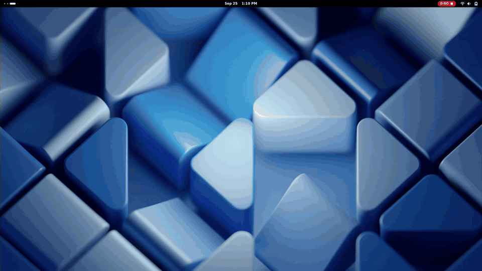
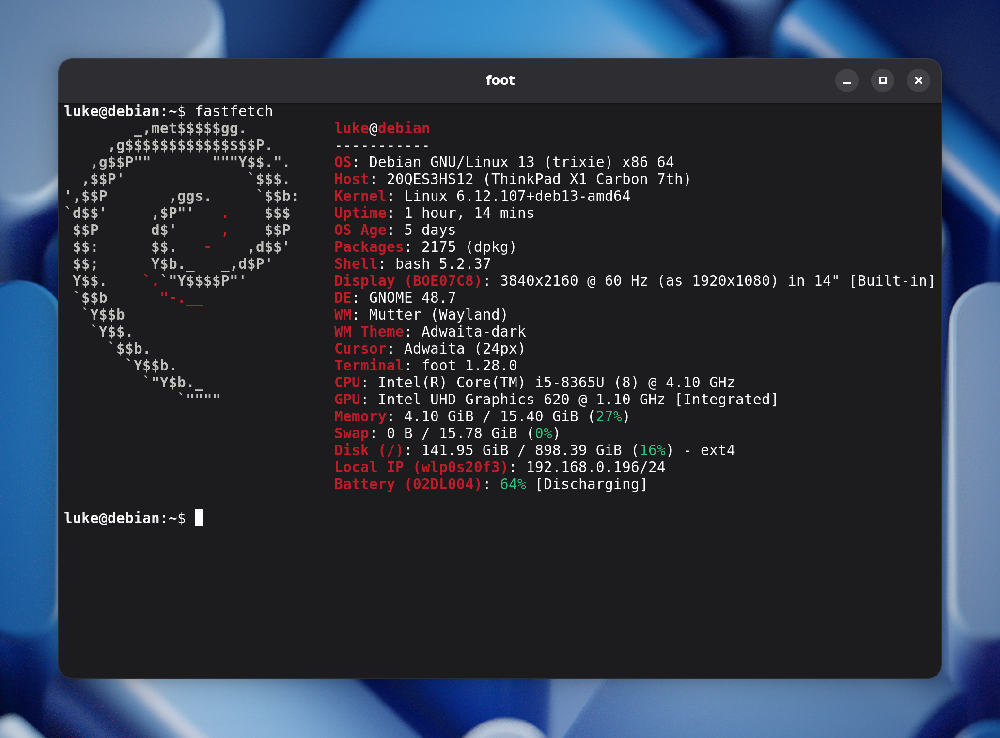

# foot-adwaita

**A fork of the [foot](https://codeberg.org/dnkl/foot) terminal that looks like a native GNOME/libadwaita app and opens a new window in about 35 ms.**

Press <kbd>Super</kbd>+<kbd>Enter</kbd>, type `ls`, press <kbd>Enter</kbd>. Every keystroke lands in the new terminal, because the window is already there before your next key.



<sub>Screencast recorded on a ThinkPad X1 Carbon 7th gen · [MP4 version](docs/adwaita/spawn-demo.mp4)</sub>

## Why

GNOME Console (kgx) looks great, but on my laptop it took about **half a second** to get from the keypress to a window I could type in. Any keys typed before that went to whichever window was focused before.

The shell wasn't the problem, and neither were VTE or kgx. **A minimal GTK4/libadwaita window with just one text field took the same ~500 ms** to its first frame. That time goes into loading and linking the GTK library stack, then setting up the display connection, the theme, fonts and the GPU renderer. Anything built on GTK pays that cost.

foot doesn't use GTK. It draws with pixman straight to Wayland surfaces, and in server mode each new window is a tiny `footclient` process. So instead of porting foot to libadwaita, I kept foot's engine and **draw the libadwaita look myself**:

- **Header bar:** 46 px tall with the "raised" shade underneath, a bold centred title that is cut off with "…" before the buttons, and round minimize/maximize/close buttons with hover and pressed states.
- **Window frame:** 15 px rounded corners, libadwaita's four-layer window shadow, and its faint inner outline. Both change when the window loses focus, the same way they do in libadwaita.
- **Colours:** exact values from libadwaita 1.7's stylesheet, in dark and light variants that follow foot's own dark/light theme.
- **Maximized and tiled windows** lose their corners and shadow, like any GTK app.
- **Resizing:** you grab a 12 px band around the window. Clicks on the rest of the shadow go to the window underneath.

The decoration code is in [`adwaita.c`](adwaita.c). Everything else is upstream foot with a few small hooks.



## Performance

Measured on an Intel i5-8365U with UHD 620 graphics, running GNOME 48 on Wayland with a 4K panel at 2× scale:

| | GNOME Console (kgx) | foot-adwaita |
|---|---|---|
| Launch → shell running in the new window | ~150 ms | **~35 ms**<sup>1</sup> |
| Launch → window has keyboard focus | **~500–640 ms** | not timed<sup>2</sup> |
| Minimal libadwaita "hello" window, launch → keyboard focus | ~500 ms | n/a |
| Rendering one frame (median) | n/a | **~1.5 ms** |

<sup>1</sup> With `foot --server` already running, from `footclient` starting until the shell is running in the new window.<br>
<sup>2</sup> The first frame is on screen 21–28 ms after the window is created (stock foot: 18–30 ms). Most of that is GNOME configuring the window, which is the same for any app; drawing the decorations adds about 3 ms. Keyboard focus wasn't timed on its own, but keys typed right after <kbd>Super</kbd>+<kbd>Enter</kbd> land in the new window.

To keep it this fast:

- **The shadow is computed once.** Its corner pieces and edges are precomputed per scale and focus state when the server starts. Every window reuses them and fills its shadow in bulk.
- **Only what changed gets redrawn.** A title change, which happens at every shell prompt, redraws only the header bar. The shadow is left alone until the window is resized, changes focus or switches theme.
- **Rounded corners don't slow down scrolling.** foot scrolls by moving pixels inside its buffer. Before each frame is drawn, the pixels under the corners and outline are put back to their unmodified state, so foot's scrolling and buffer-reuse tricks still work.
- **The build is optimised** with profile-guided optimisation (PGO) and link-time optimisation (LTO).

## Install

Build dependencies: meson, ninja, wayland-protocols, pixman, fcft, tllist, utf8proc, xkbcommon and fontconfig. On Debian:
`apt install meson ninja-build libwayland-dev wayland-protocols libpixman-1-dev libfcft-dev libtllist-dev libutf8proc-dev libxkbcommon-dev libfontconfig-dev`

```sh
git clone https://github.com/lszl84/foot-adwaita && cd foot-adwaita

# Optimised build, installed to ~/.local. Briefly opens a window to collect the profile.
./pgo/pgo.sh full-current-session . build-pgo --prefix=$HOME/.local \
    --buildtype=release -Db_lto=true -Ddocs=disabled -Dthemes=false
meson install -C build-pgo
```

For the instant windows shown above, run `foot --server` at login and open windows with `footclient`. This is foot's standard server mode.

For everything else about foot (configuration, shortcuts, server mode and more), see the upstream [README.foot.md](README.foot.md) and `man foot.ini`.

## Credits

foot is written by [Daniel Eklöf](https://codeberg.org/dnkl) and contributors, and is MIT licensed (see [LICENSE](LICENSE)). All the hard work of making a fast terminal is theirs. This fork only adds the GNOME look.

The visual values come from [libadwaita](https://gitlab.gnome.org/GNOME/libadwaita) and [GNOME Console](https://gitlab.gnome.org/GNOME/console).

## About me

I'm Luke. I build things and make tutorials about them.

- 🌐 Website: [devmindscape.com](https://devmindscape.com)
- ▶️ YouTube: [@devmindscapetutorials](https://www.youtube.com/@devmindscapetutorials)
- ❤️ Support my work on [Patreon](https://www.patreon.com/c/LukeDevMindscape)
